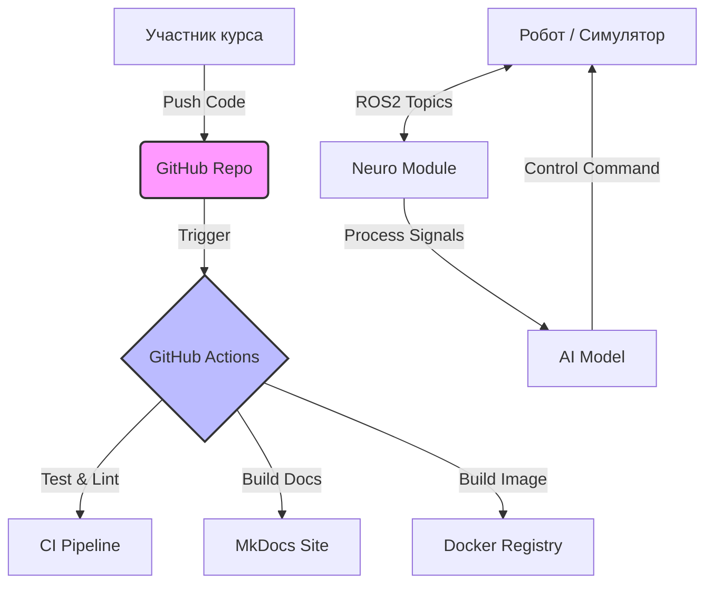
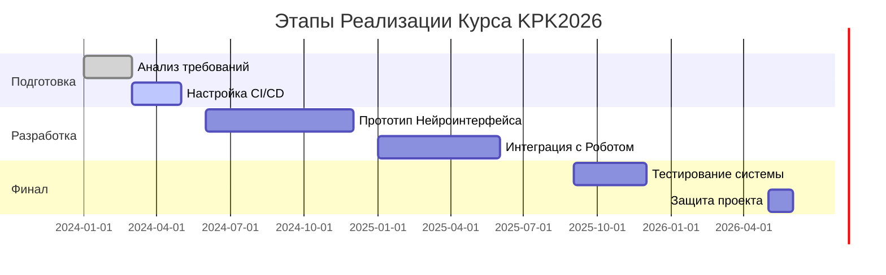

```markdown
# 🤖 KPK2026: Робототехника и Нейротехнологии

[](https://opensource.org/licenses/MIT)
[]()
[](https://www.python.org/downloads/)
[](http://www.ros.org/)

> **Курс по организации проектной деятельности**. Разработка комплексных робототехнических систем с интеграцией нейроинтерфейсов и современных цифровых инструментов (CI/CD, Digital Twins, Agile).

---

## 📖 О Проекте

Репозиторий **KPK2026** служит центральной хаб-платформой для учебного курса. Здесь сосредоточены не только исходные коды проектов, но и инфраструктура для управления жизненным циклом разработки (SDLC) в области High-Tech.

**Цели курса:**
1. Освоение методологий Agile/Scrum в инженерии.
2. Разработка ПО для роботов (ROS2) и обработка нейро данных (BCI).
3. Внедрение DevOps практик (автоматизация тестирования и документирования).

---

## 🚀 Расширенный Функционал Репозитория

Этот репозиторий выходит за рамки простого хранилища кода. Мы внедрили следующие инструменты для автоматизации и контроля качества:

| Функция | Описание | Инструменты |
| :--- | :--- | :--- |
| **📄 Auto-Documentation** | Автоматическая генерация документации сайта при каждом пуше в ветку `main`. | `MkDocs`, `Material Theme` |
| **🧪 CI/CD Pipeline** | Автоматический запуск линтеров, юнит-тестов и сборка Docker-образов. | `GitHub Actions`, `Docker` |
| **🧠 Neuro-Data Pipeline** | Готовые скрипты для предобработки сигналов ЭЭГ/ЭМГ и визуализации. | `MNE-Python`, `PyTorch` |
| **🤖 Digital Twin** | Конфигурации симуляторов для тестирования логики робота без железа. | `Gazebo`, `Webots` |
| **📊 Project Dashboard** | Интеграция с GitHub Projects для трекинга задач и спринтов. | `GitHub Projects`, `ZenHub` |

---

## 🏗 Архитектура и Структура

### Диаграмма Взаимодействия Компонентов



### Дерево Файлов

```text
KPK2026/
├── .github/                  # Конфигурация CI/CD и шаблоны Issues
│   ├── workflows/            # YAML файлы для GitHub Actions
│   └── ISSUE_TEMPLATE/       # Шаблоны задач (Bug, Feature)
├── docs/                     # Исходники документации (Markdown)
│   ├── curriculum/           # Программа курса
│   └── api_ref/              # Авто-генерируемая справка
├── hardware/                 # Схемы и чертежи (KiCad, STL)
│   ├── pcb/
│   └── mechanics/
├── neuro/                    # Модуль нейротехнологий
│   ├── datasets/             # Примеры наборов данных ЭЭГ
│   ├── models/               # Архитектуры нейросетей
│   └── preprocessing/        # Фильтрация сигналов
├── robotics/                 # Основное ПО робота (ROS2)
│   ├── drivers/              # Драйверы устройств
│   ├── navigation/           # Навигационный стек
│   └── simulation/           # Launch файлы для Gazebo
├── scripts/                  # Утилиты для развертывания
├── .gitignore
├── docker-compose.yml        # Оркестрация контейнеров
├── mkdocs.yml                # Настройки генератора документации
└── README.md
```

---

## 🛠 Технологический Стек

*   **Языки:** Python 3.10+, C++17, Bash
*   **Robotics:** ROS2 Humble, MoveIt2, Nav2
*   **NeuroTech:** MNE-Python, BrainFlow, TensorFlow/Keras
*   **DevOps:** Docker, GitHub Actions, SonarQube
*   **Management:** GitHub Projects, Notion API

---

## 📅 Дорожная Карта (Roadmap 2024-2026)



---

## 📦 Быстрый Старт (Quick Start)

### 1. Клонирование
```bash
git clone https://github.com/your-username/KPK2026.git
cd KPK2026
```

### 2. Настройка окружения (Docker)
Рекомендуемый способ запуска, чтобы избежать зависимостей.
```bash
docker-compose up --build
```

### 3. Локальная разработка (Python)
```bash
python3 -m venv venv
source venv/bin/activate
pip install -r requirements.txt
```

### 4. Запуск симуляции
```bash
ros2 launch robotics/simulation robot_world.launch.py
```

---

## 🤝 Workflow и Вклад (Contribution)

Мы используем упрощенную модель **GitHub Flow**:

1.  **Создайте ветку** от `develop`: `git checkout -b feature/my-new-feature`
2.  **Внесите изменения** и сделайте коммиты (используйте [Conventional Commits](https://www.conventionalcommits.org/)).
3.  **Запушьте ветку** и создайте **Pull Request**.
4.  **Code Review:** Минимум 1 аппрув от ментора required.
5.  **Merge:** После прохождения CI-тестов.

> ⚠️ **Важно:** В ветку `main` запрещен прямой пуш. Все изменения только через PR.

---

## 👥 Команда Проекта

| Роль | Имя | Контакты |
| :--- | :--- | :--- |
| **Lead Instructor** | Иван Иванов | [email@example.com](mailto:email@example.com) |
| **Tech Lead** | Анна Петрова | [GitHub](https://github.com/) |
| **Neuro Specialist** | Алексей Сидоров | [Telegram](https://t.me/) |

---

## 📄 Лицензия

Этот проект распространяется под лицензией **MIT**. См. файл [LICENSE](LICENSE) для деталей.

---

<div align="center">

**KPK2026** © 2024-2026  
[Поддержать проект](#) | [Сообщить об ошибке](https://github.com/your-username/KPK2026/issues)

</div>
```
